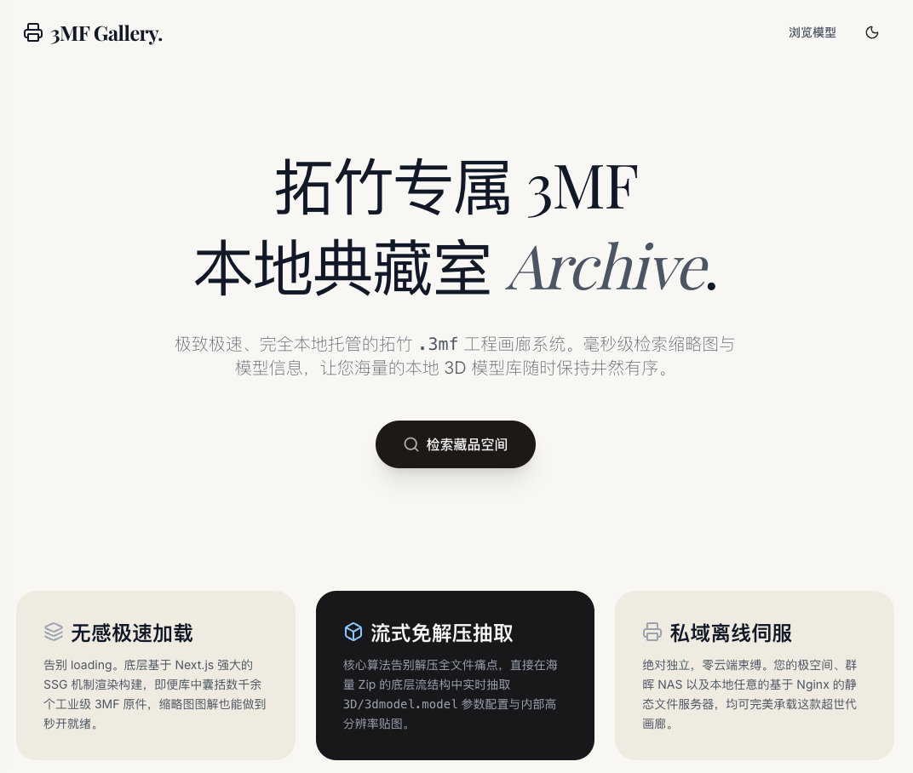
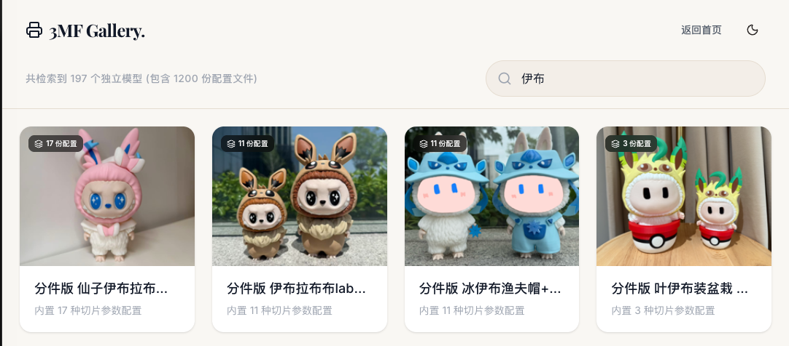

# 3MF Gallery

[中文](./README.md) | [English](./README-en.md)

---

## 📸 效果展示

| 主页 | 列表/搜索页 | 详情页 |
| :---: | :---: | :---: |
|  |  |  |

## 📦 项目简介

**3MF Gallery** 是一个完全本地化、离线优先的 `.3mf` 3D 打印工程文件浏览器。它能自动扫描本地目录下的所有 `.3mf` 文件，提取缩略图、元数据（标题、描述、设计师、切片配置、耗材信息等），并生成一个静态画廊网站，方便浏览、搜索和下载。

适用于在群晖 NAS、极空间、本地服务器等任何可运行 Nginx 的环境中，托管和管理你的 3D 打印模型库。

### ✨ 核心特性

- 🔍 **智能元数据提取** — 流式解析 `.3mf`（ZIP 格式）内部的 XML 元数据，提取标题、描述、设计师、许可证、切片参数等信息
- 🖼️ **自动缩略图抓取** — 自动提取内嵌的缩略图、分盘渲染图和实拍照片
- ⚡ **极速 SSG 构建** — 基于 Next.js 静态导出，数千模型也能秒开
- 🔎 **实时模糊搜索** — 按名称、文件路径即时过滤，带防抖优化
- 📁 **同名模型自动聚合** — 同名的多个 `.3mf` 文件会被合并为一个条目，展示不同的切片配置变体
- 🧩 **耗材与打印信息** — 自动提取耗材类型、颜色 HEX、用量和预估打印时间
- 🏠 **完全离线** — 零云端依赖，所有数据保留在本地
- 🚀 **高速缓存** — 基于文件修改时间 + 文件大小的指纹缓存，增量扫描秒级完成

## 📂 项目结构

```
nginx-root/                  # Nginx 根目录
├── index.html               # 入口页（构建产物复制）
├── website-dist/            # 静态构建产物
│   ├── library/
│   │   └── index.html       # 画廊页
│   ├── _next/               # Next.js 静态资源
│   ├── assets/
│   │   ├── thumbs/          # 提取的缩略图
│   │   └── previews/        # 提取的预览图
│   └── manifest.json        # 模型元数据清单
├── website/                 # ← 本项目源码
│   ├── src/
│   │   ├── app/             # Next.js App Router 页面
│   │   ├── components/      # React UI 组件
│   │   └── lib/             # 3MF 解析器 & 工具库
│   ├── scripts/
│   │   ├── extract.ts       # 元数据提取脚本
│   │   └── deploy.sh        # 一键部署脚本
│   └── nginx.conf.example   # Nginx 配置参考
└── 你的模型文件夹/           # 存放 .3mf 文件的目录
```

## 🚀 快速开始

### 前置要求

- **Node.js** ≥ 18
- **npm** ≥ 9
- 一个或多个包含 `.3mf` 文件的目录

### 1. 克隆项目

```bash
# 将本项目克隆到你的模型根目录下
cd /你的模型根目录
git clone https://github.com/lie5860/3mf-gallery.git website
cd website
```

### 2. 安装依赖

```bash
npm install
```

### 3. 提取模型数据

```bash
npm run extract
```

这会递归扫描项目父目录（即 Nginx 根目录）下的所有 `.3mf` 文件，提前提取缩略图和元数据到 `public/` 目录中。

**自定义扫描目录**（可选）：

```bash
# 单目录
MODELS_DIR=/path/to/models npm run extract

# 多目录（冒号分隔）
MODELS_DIRS=/path/to/dir1:/path/to/dir2 npm run extract
```

### 4. 本地开发预览

```bash
npm run dev
```

打开 [http://localhost:3000](http://localhost:3000) 即可预览。

### 5. 构建静态站点

```bash
npm run build
```

构建产物会输出到 `out/` 目录，可以用任何静态文件服务器托管。

## 🌐 部署

### 方式一：一键部署脚本（推荐）

```bash
npm run deploy
```

此脚本会依次执行：
1. 提取 3MF 元数据
2. 构建 Next.js 静态站点
3. 将静态资源部署到 `../website-dist/`，并复制 `index.html` 到上层目录（建议将该上层目录作为 Nginx 等 HTTP 服务的根目录）

> **💡 提示：对于群晖及其它 Node.js 环境不完整的系统，你可以直接使用 Docker 来完成部署操作：**
> 
> ```bash
> docker run --rm -v /你的模型根目录:/app node:20 /bin/sh -c "cd /app/website && npm install && npm run deploy"
> ```
> *(注：示例中的 `/你的模型根目录` 需要替换为你实际存放模型和代码的绝对路径，例如 `/volume1/docker/3mf-models`)*

### 方式二：手动部署到 Nginx

1. 构建静态站点：

```bash
NEXT_PUBLIC_BASE_PATH=/website-dist npm run build
```

2. 将 `out/` 目录的内容复制到 Nginx 可访问的位置

3. 配置 Nginx（参考 `nginx.conf.example`）：

```nginx
server {
    listen 80;
    server_name _;

    root /path/to/your/nginx-root;
    index index.html;

    location / {
        try_files $uri $uri.html $uri/ =404;
    }

    # 3MF 文件强制下载
    location ~* \.3mf$ {
        add_header Content-Disposition "attachment";
        types { application/octet-stream 3mf; }
    }

    # 静态资源缓存
    location /website-dist/_next/static/ {
        expires 1y;
        add_header Cache-Control "public, immutable";
    }
}
```

### 方式三：简易预览（无需 Nginx）

```bash
npm run build
npm run serve
```

会使用 `serve` 在本地托管 `out/` 目录。

## ⚙️ 环境变量

| 变量名 | 说明 | 默认值 |
|--------|------|--------|
| `MODELS_DIR` | 单个模型扫描目录 | 项目父目录 `../` |
| `MODELS_DIRS` | 多个模型扫描目录（冒号分隔） | — |
| `NEXT_PUBLIC_BASE_PATH` | 站点子路径前缀 | `""` |

## 🛠️ 技术栈

- [Next.js](https://nextjs.org/) 16 — React 全栈框架（SSG 静态导出模式）
- [React](https://react.dev/) 19 — UI 框架
- [Tailwind CSS](https://tailwindcss.com/) 4 — 原子化 CSS
- [Framer Motion](https://www.framer.com/motion/) — 动画库
- [Lucide Icons](https://lucide.dev/) — 图标库
- [node-stream-zip](https://github.com/nickreese/node-stream-zip) — 流式 ZIP 解析
- TypeScript — 全量类型安全

## 📄 License

MIT
